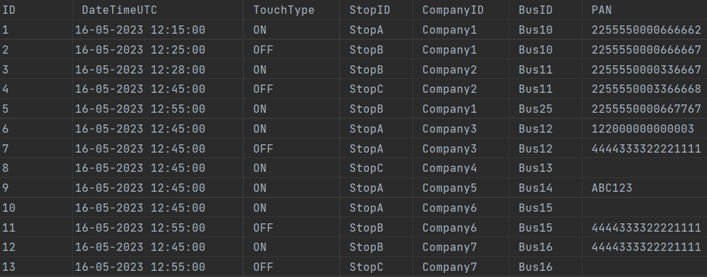
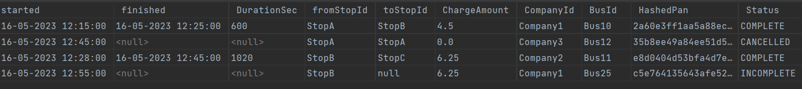
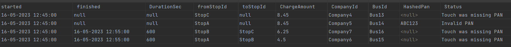
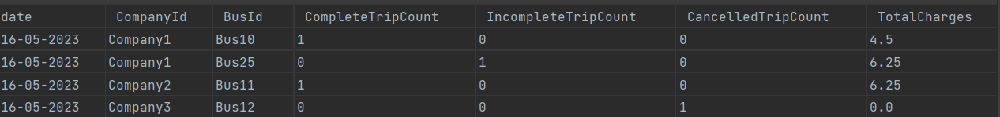

# Travel System 
This Travel System via REST API allow user to process and create trips from touchData.csv and then export them into 3 files trips.csv, unprocessableTouchData.csv, and summary.csv in a zip file

## Assumption
* When creating trips from touch data, we identify unprocessed trips base on PAN value (missing, invalid data) then mark in reason column.
* If touch on or touch off record of one trip miss PAN value -> we mark this trip is unprocessable
* After that, we perform the filter to get the list for processed trips and unprocessed trips and write them to files


## Features implemented
* Travel System operations supported
  - allow the user to upload own touch data CSV file
  - process and create trips base on touch data input
  - export 3 files trips.csv, unprocessableTouchData.csv, summary.csv in zip file
* Unit test  
  
## Runtime requirements
* [JDK 11](https://jdk.java.net/11/) or later (JDK 8 is supported as well)

## Rest Endpoints
### Export files  
* __GET__ http://localhost:8080/api/trip/zip-export  
``curl --location --request GET 'http://localhost:8080/api/trip/zip-export' \
  --header 'Content-Type: application/zip' \
  --form 'file=@"path-of-your-file"'``
  
## Test data: 
* src/test/resources/test-data/touchData.csv

## Build and Run
```
mvn clean install
mvn spring-boot:run
```

## Testing
Input touchData.csv contain list of touch records following the scenario:
- 2 completed trips
- 1 incomplete trip
- 1 cancelled trip
- 4 unprocessed trips (missing pan, invalid pan)



## Result:

#### trips.csv


#### unprocessableTouchData.csv



#### summary.csv




